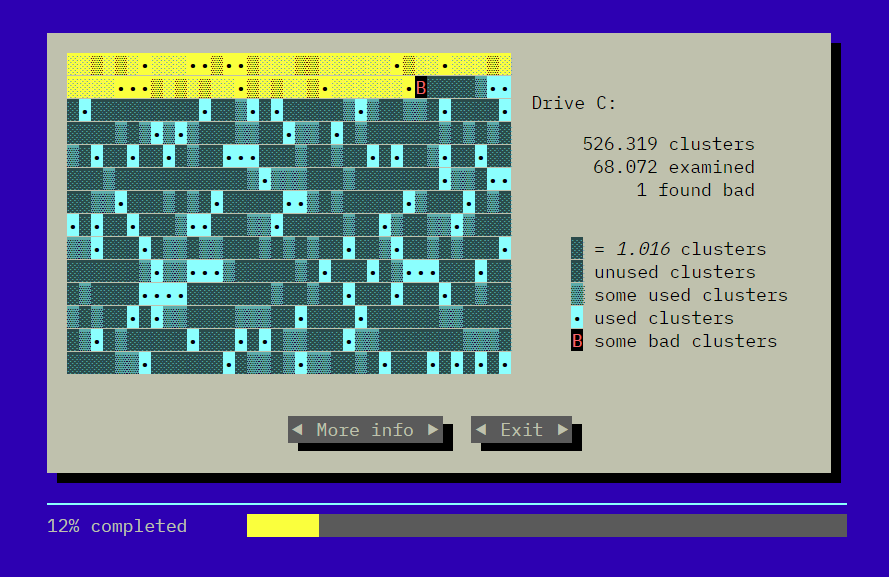

# Scandisk (WebComponents with Lit)

`C:\> SCANDISK C:`

Microsoft ScanDisk old tool from MS-DOS with [Lit](https://lit.dev/) (WebComponents).

⚡ [Lit](https://lit.dev/) Version: https://manzdev.github.io/twitch-scandisk/

⚡ HTML+CSS+JS old version: https://codepen.io/manz/pen/KLPEby

